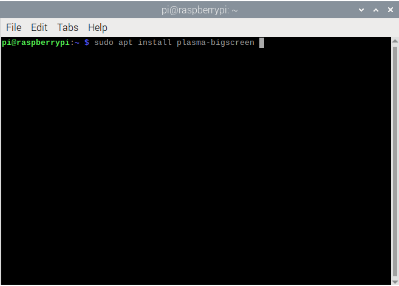

# Desktop Environment

Once flatpak is setup, the next step is to install the Plasma Bigscreen desktop environment.

## Raspberry Pi OS

Open a terminal window and run:

`sudo apt install plasma-bigscreen`

* This command will take a while to run. Especially on slow internet connections

Once that's finished installing, continue to the next step.

## Ubuntu 24.04.1

The above command needs to be changed slightly for Ubuntu.

In addition to installing plasma-bigscreen, you'll also need to install kdeconnect and plasma-workspace-wayland.

`sudo apt install plasma-bigscreen kdeconnect plasma-workspace-wayland`

* The Kubuntu derivative of Ubuntu has kdeconnect install by default, but not the other two packages.

## Other Operating Systems

Anything based on Debian (eg. Ubuntu, Linux Mint) should work with the Ubuntu 24.04.1 instructions.

Other distributions may or may not provide packages for Plasma Bigscreen.

You will need to check if your distribution provides it or not. Otherwise you may need to switch to a Debian-based distribution, or compile it yourself.

## Next Step

Continue to configuring the [Login Screen](Greeter.md)