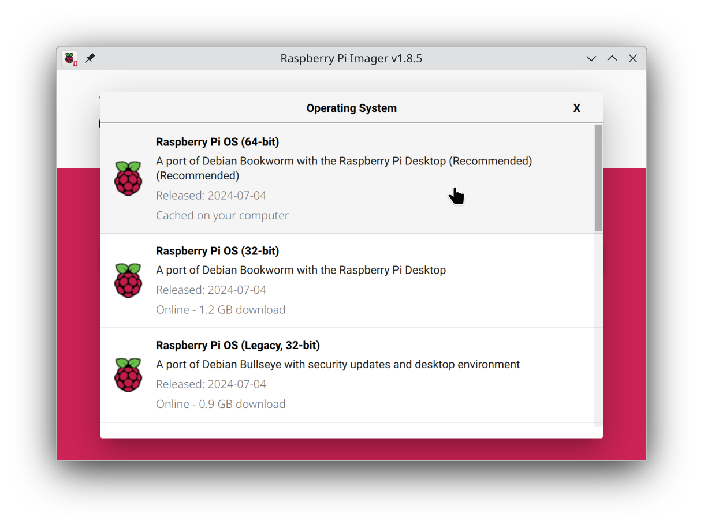
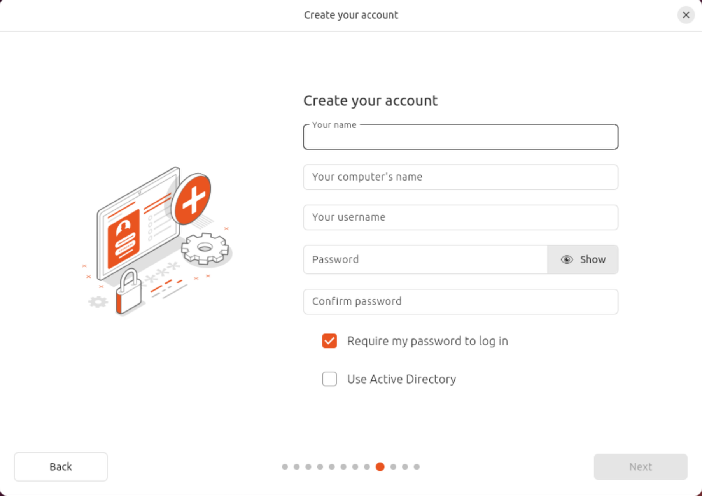

# Operating System

## Raspberry Pi OS

To start with, install [Raspberry Pi OS](https://www.raspberrypi.com/software/operating-systems/) (64 bit) on your Raspberry Pi.

Install the "Raspberry Pi OS with desktop" version, with or without the recommended software. Do not install the lite version.

* The lite version will work, but will require extra steps not covered in this guide.

* The 32-bit version might work (for now), but is not recommended, since an increasing number of platforms and pieces of software are becoming 64-bit only.

There is nothing special you need to do during setup. Just install the OS like normal and reboot.

## Ubuntu 24.04.1

The latest desktop version of Ubuntu will also work, both on a Raspberry Pi or on another device.

Install like normal. Setup your language, username, internet connection, etc. as appropriate.

* Even though this is a media center PC, you should consider keeping the "Require my password to log in" checkbox ticked for now, just in case something goes wrong during setup and breaks the default DE. You can setup passwordless login after installation instead.

## Other Operating Systems

Other operating systems should also work, both on a Raspberry Pi and on other devices.

Generally speaking, any operating system which can run [Plasma Bigscreen](https://plasma-bigscreen.org) should work.

Something based on Debian, such as Ubuntu or Linux Mint, will make it easier to follow the instructions in this repository.

You can use other operating systems not based on Debian, but you'll need to figure out some parts of this guide for yourself.

## Boot your OS

After installing your OS of choice, please boot/reboot the device and run the newly installed OS.

Proceed to the next step after you've booted the target device and logged in.

## Next Step

Continue to [Flatpak setup](Flatpak.md)