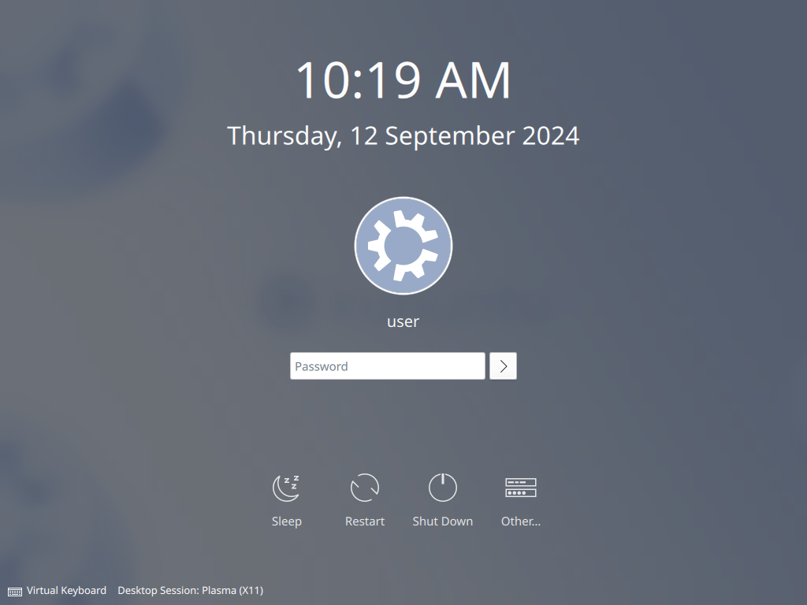

# Finish Setup

Once you've finished adding streaming services, open a terminal and run:

`sudo systemctl restart lightdm`

Or you can just reboot, if you prefer.

Either way, you should end up on the login screen.

* If you have auto-login enabled, then you'll end up on the desktop instead. If that's the case, logout.

## Raspberry Pi OS

From the login screen, click on the wrench icon up the top right side of the screen. It will provide you with a list of different desktop environments.

Choose either Plasma Bigscreen (X11) or Plasma Bigscreen (Wayland) depending on which one you chose earlier in this guide.

In short: if you want to use a remote, and you want to use it with programs other than just Kodi, choose X11. Otherwise, choose Wayland.

Once you've made your choice, login.

## Kubuntu 24.04.1

On Kubuntu, or other operating systems with KDE Plasma by default, the session chooser is down the bottom left.

Click on "Desktop Session: Plasma (X11)" to choose a different session, per the Raspberry Pi OS instructions above.

## Tada!

If everything went well, you should now be greeted with a smart TV-like user interface.

You should see tiles for your streaming services, and selecting one should launch the web version of that streaming service.
