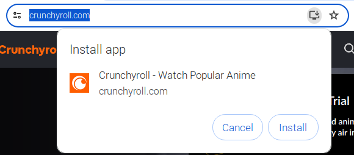
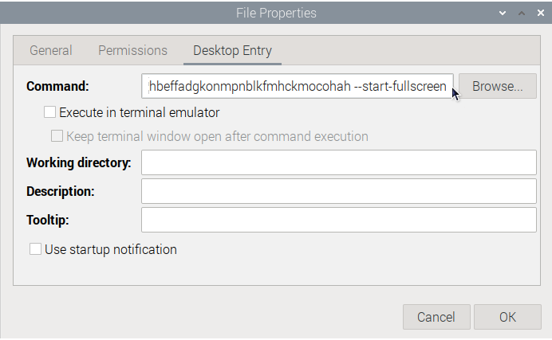

# Chromium

To start with, open Chromium and perform any first-time setup required.

## KWallet

You might be asked about KWallet integration, now that KDE desktop environments (plasma bigscreen and its dependencies) have been installed.

If you are prompted about KWallet, select "Classic blowfish encrypted file", leave the password empty, and continue.

Or you can setup a password, if you want to. But this is a media player, and trying to enter passwords with a remote isn't fun.

## PWAs

Once that's done, browse to any websites you want to stream and install their PWAs.

You will usually see an Install icon appear in the right side of the address bar, like so:

Click on that icon to bring up an install prompt.

Click on the Install button to add the website to your desktop as a PWA.

Do this for every website you want to stream.

## Fullscreen

Right click on the desktop icon of an installed PWA and click on Properties.

Open the Desktop Entry tab.

The first field on this screen is called "Command". It should start with /usr/bin/chromium-browser

Go to the very end of the command and press Space, then type in "--start-fullscreen" without the quotation marks.

Press OK to save the change.

Do this for every PWA.

Doing this will ensure that when we run the PWA from Plasma Bigscreen later, it will open in fullscreen mode by default.

## Next Step

Go back to the [Browser Setup](README.md)