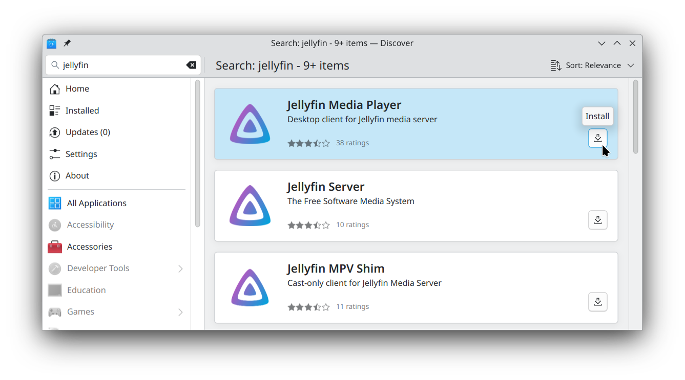
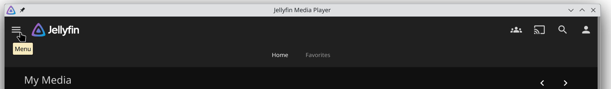
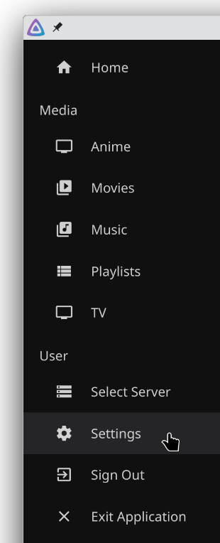
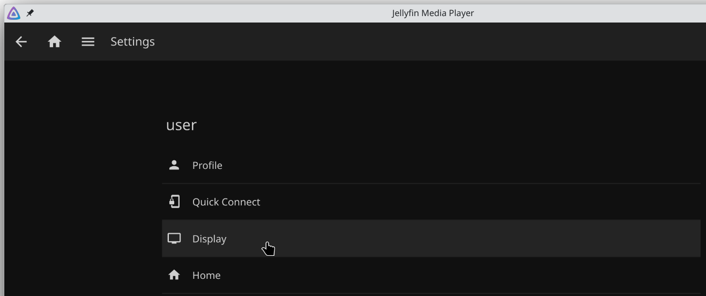
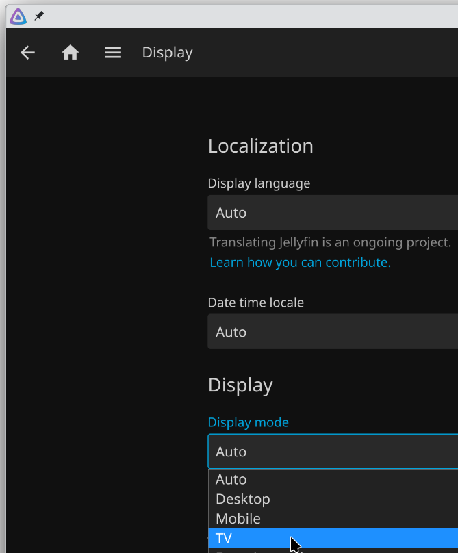
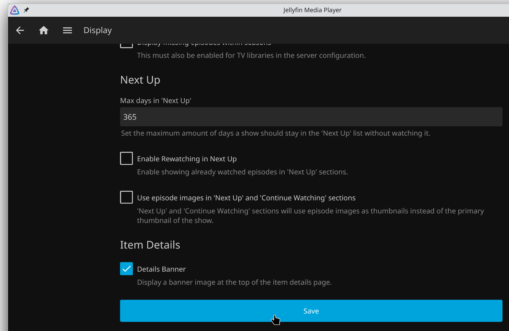

# Jellyfin

Jellyfin provides both a web interface and a desktop client.

The web version is suitable for cases where your videos are on a separate device than the one being used to play them.

eg. If you store videos on a NAS or home server which runs Jellyfin, but want to watch them from a Raspberry Pi.

The desktop application is more suitable if you're watching videos from the same device which has them stored.

eg. If you download a video onto your desktop PC and watch it directly from there.

## Web Version

There is no special setup required for the web version of Jellyfin to work.

It will run by default when installed on a server or NAS.

You should be able to access it on port 8096 of the server's IP address by default.

eg. http://192.168.1.100:8096

Whatever the IP address is, access your self-hosted Jellyfin instance from the Raspberry Pi in your browser, then proceed to the "TV Mode" section further down this page.

* Remember to create a shortcut or PWA! See the Browsers section for instructions on how to do this

## Desktop Client

Jellyfin provides [several options](https://jellyfin.org/downloads/clients/) for installing their desktop client.

In this case, the one we want is the "Jellyfin Media Player".

Assuming you followed the steps earlier in this guide, you should already have Flatpak/Flathub setup on your system.

If so, run:

`flatpak install -y flathub com.github.iwalton3.jellyfin-media-player`

Or, if your desktop environment supports it, you can simply search for Jellyfin in your operating system's "app store", such as KDE Discover.

* If you install it this way, make sure you grab "Jellyfin Media Player", not one of the other packages such as "Jellyfin Server".

* Warning! Some stores will install the Snap or Native version of Jellyfin instead of the flatpak version. This is fine, but you may need to figure some things out yourself during later steps, since the instructions in this repository were written for the Flatpak version.

## Post-install

These actions can be taken at any time.

But they're easier to do now, from a desktop, with a keyboard and mouse.

### Media sources

Add any desired media sources or plugins to your jellyfin installation and verify that they're accessible.

Some sources may require a username and password, or a URL, which will be easier to enter now with a keyboard.

### Fullscreen

With Jellyfin open, press F11 to put it into fullscreen.

Jellyfin will remember its previous state. So the next time you launch it (eg. with a remote, and thus no F11 key), it will already be in fullscreen by default.

### TV Mode

Putting Jellyfin into TV mode will give you a more TV-like user interface, and make it easier to use Jellyfin with arrow keys, gamepads, and remote controls.

Click on the Menu icon up the top left side of the website/app.

Click on Settings.

Click on Display.

Change the display mode from Auto to TV.

Scroll down to the bottom of the page and click on Save.

Afterwards, close and reopen the app/website for the change to take full effect.

## Next Step

Go back to [services list](README.md)