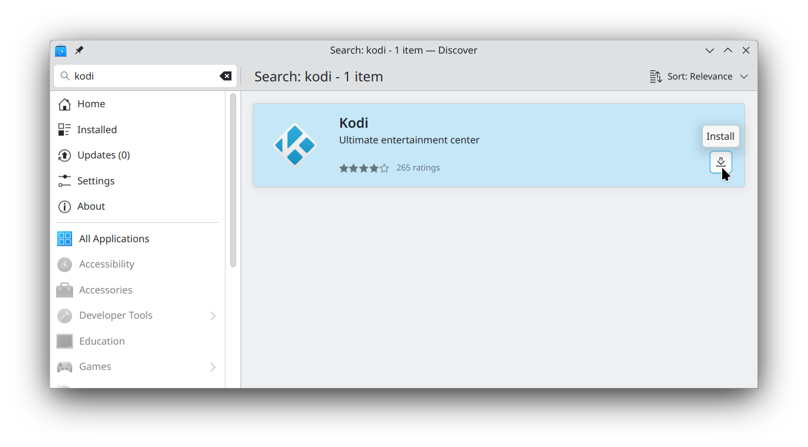

# Kodi/XBMC

Kodi has a web version, but it is disabled by default.

The web version is only suitable for cases where your videos are on a separate device than the one being used to play them.

eg. If you watch videos on a Raspberry Pi, but store them on a NAS or home server, and both devices run Kodi.

The native application is suitable for either case. It doesn't matter if the videos are on your device or if they're hosted elsewhere, it'll work either way.

## Web Version

If you want to use the web version, check [Kodi's official documentation](https://kodi.wiki/view/Web_interface) for instructions.

## Desktop Version

Assuming you followed the steps in the Desktop Apps section of this guide, you should already have Flatpak/Flathub setup on your system.

If so, run:

`flatpak install flathub tv.kodi.Kodi`

Or, if your desktop environment supports it, you can simply search for Kodi in your operating system's "app store", such as KDE Discover.

## Post-install

There isn't much needed here. Kodi works quite well out-of-the-box.

You might want to take this opportunity to add any media sources or plugins to your kodi install, since it'll be easier to do that with a keyboard/mouse than later on with a remote.

In particular, I recommend installing the [SlyGuy Kodi repository](SlyGuy.md), which contains addons for a wide variety of streaming services.

Addons aside, the only thing you'll likely want to do post-install is to make it work with your remote control, if you're using one. But we'll get to that later.

## Next Step

Go back to [services list](README.md)